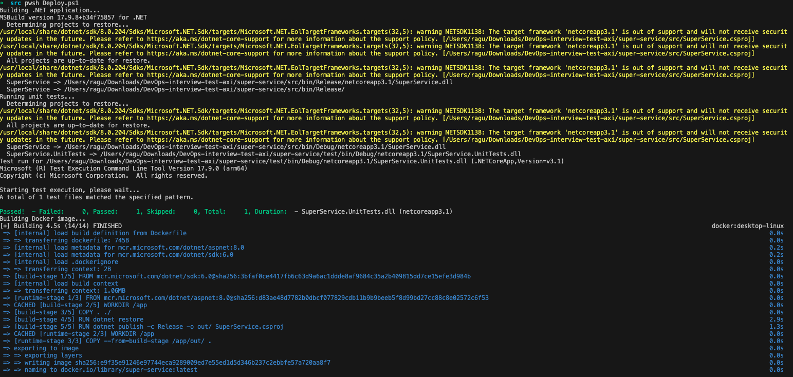
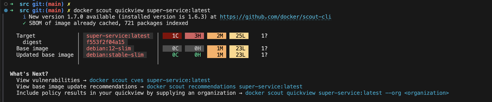
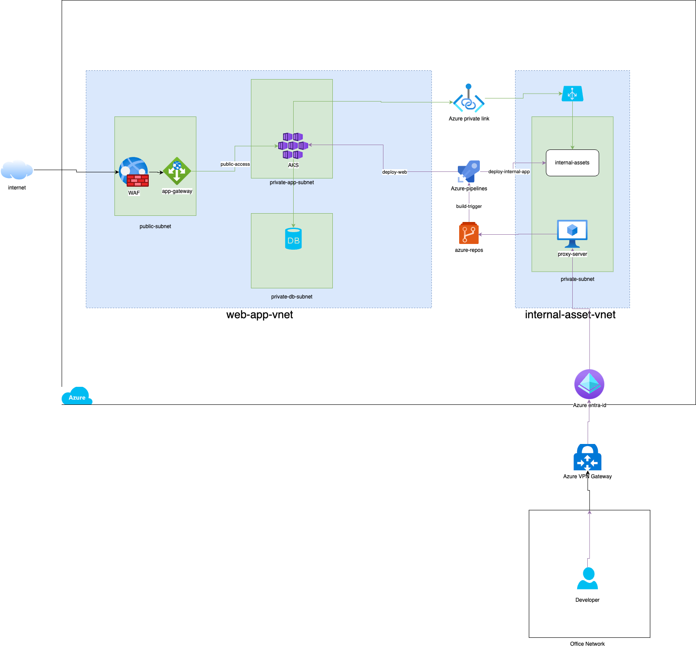

# Instructions to follow to test the solution
## Pre-requisites 
1. Docker Desktop or Docker Engine running on your machine 
2. Install .NET framework 3.1.0 on your machine 
    https://dotnet.microsoft.com/en-us/download/dotnet/thank-you/sdk-3.1.100-windows-x64-installer

## Run powershell script `Deploy.ps1` to compile, test & build docker image
```
git clone https://github.com/ragu101/super-service.git
cd super-service\src
pwsh Deploy.ps1
 (or)
./Deploy.ps1
```
Following is the expected output


## Vulnerability details in the image 
if `docker scout` installed on your system, you can check the vulnerabilities by running below command
```
docker scout cves super-service:latest
```
The main image has 1 Critical, 3 High, 2 Medium & 25 Low vulnerabilities 


## Cloud Design overview


### Design description:
#### Accessing external & internal application
- web-app & internal-asset are deployed into two different virtual networks, web-app especially deployed onto `Azure Kubernetes service`.
- web-app is securely exposed to internet through `Azure Application Gateway` & `Web Application Firewall`.
- web-app can access internal-asset through `Azure Private link` (or through `Express route` or `vnet peering`) configuration without traffic being routed through internet.
#### Monitoring & Alerting
- `Azure monitor` service can provide metrics, logs, and alerts for monitoring network traffic, bandwidth usage, latency, and availability of Private Link endpoints and ExpressRoute circuits. We can use this to alert the respective teams that depend on web-app endpoint.
#### Auto Deployment
- Office network is connected to Azure cloud using `Azure VPN Gateway`, through which developer can access azure devops components such as `azure repos & azure pipelines`.
- Office network traffic to azure devops should be whitelisted through a `proxy server` otherwise a potential code leak is possible if access token or ssh key is compromised.
- Both vnets can be configured in `azure devops pipeline`, so that developer can build & deploy automatically.
#### IaaC (Infrastructure as code)
- Option 1: Integrating terraform as part of azure devops pipeline & storing the state file in Azure Blob Storage 
- Option 2: Enable gitops based infra privisioning by deploying argoCD & cross plane to AKS